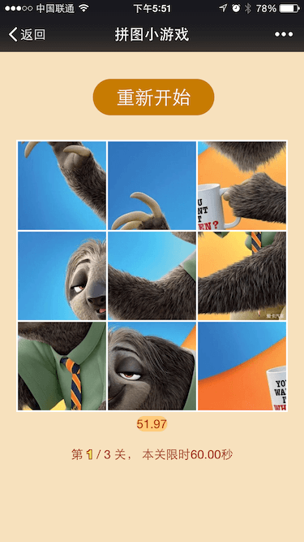

# HTML5拼图小游戏

   
[演示地址](http://zyy1217.com/project/puzzle/)

## 项目描述：
一个基于HTML5和Canvas的拼图游戏，使用了rem自适应布局，移动端和网页端都可以使用。

使用了canvas绘图，移动端使用zepto轻量级浏览器JS库，网页端使用了HTML5自带的drag事件。


## 利用canvas切出小块图片

我们知道现在的拼图游戏都是由九张小图片依次排列组成的，就是类似九宫格那样。那么以前的做法就是我们利用Photoshop这样的工具把原始大图【尺寸一般都是正方形的哦】切成九张小块的正方形小图，但是这种做法有点不灵活，如果我们要更换图片的话，就得重新去切图，好麻烦。。。不过没关系，现在我们有了canvas！利用canvas我们可以很轻松的做到这些。核心代码如下：
```javascript
var image = new Image();
image.onload = function() {
    var index = 1;
    for (var i=0; i<3; i++) {
        for (var j=0; j<3; j++) {
            ctx.drawImage(image, 300*j, 300*i, 300, 300, 0, 0, 300, 300);
            $lis.eq(index-1).find('img').attr('src', canvas.toDataURL('image/jpeg'));
            index++;
        }
    }
}
//900x900
image.src = "shanlian.jpg";
```

## 实现小块图片的随机排列

这里的核心是利用了javascript数组的随机排序，核心代码如下：
```javascript
imgArr.sort(function(a, b) {
    return Math.random() - Math.random();
});
var index = 1;
for (var i=0; i<3; i++) {
    for (var j=0; j<3; j++) {
        ctx.drawImage(image, 300*j, 300*i, 300, 300, 0, 0, 300, 300);
        $lis.eq(imgArr[index-1]-1).find('img').data('seq', index).attr('src', canvas.toDataURL('image/jpeg'));
        index++;
    }
}

```

## 相关touch事件的监听和实现
这里无非就是利用向左滑动，向右滑动这些去实现拼图的操作。核心代码如下：
```javascript
//阻止手机上浏览器的弹性下拉。。。
$('body').on('touchstart', function(e) {
    e.preventDefault();
});
$lis.on('swipeLeft', function(e) {
    e.preventDefault();
    var $this = $(this);
    var index = $this.index();
    var html = $this.html();
    var $prev = $this.prev();
    if ($.inArray(index, [3, 6]) > -1 || $prev.size() <= 0) {
        return false;
    }
    $this.html($prev.html());
    $prev.html(html);
    App.check();
});
$lis.on('swipeRight', function(e) {
    e.preventDefault();
    var $this = $(this);
    var index = $this.index();
    var html = $this.html();
    var $next = $this.next();
    if ($.inArray(index, [2, 5]) > -1 || $next.size() <= 0) {
        return false;
    }
    $this.html($next.html());
    $next.html(html);
    App.check();
});
$lis.on('swipeUp', function(e) {
    e.preventDefault();
    var $this = $(this);
    var html = $this.html();
    var index = $this.index() - 3;
    var $up = $lis.eq(index);
    if (index >= 0 && $up.size() > 0) {
        $this.html($up.html());
        $up.html(html);
        App.check();
    }
});
$lis.on('swipeDown', function(e) {
    e.preventDefault();
    var $this = $(this);
    var html = $this.html();
    var index = $this.index() + 3;
    var $down = $lis.eq(index);
    if (index < 9 && $down.size() > 0) {
        $this.html($down.html());
        $down.html(html);
        App.check();
    }
});
    
```

## 鼠标拖动事件的监听和实现
```javascript
 //网页端
 $lis.draggable="true";
 $lis.on('dragstart',function(e){
 e.dataTransfer.setData("Index",$(this).index());
 });
 $lis.on('dragover',function(e){
 e.preventDefault();
 });
 $lis.on('drop',function(e){
 e.preventDefault();
 var index=e.dataTransfer.getData("Index");
 var prev = $lis.eq(index);
 var html = $(this).html();
 $(this).html(prev.html());
 $(prev).html(html);
 App.check();
 });
```

                
                
## 游戏是否完成的判断

这里的话，拼图顺序的每一次变化都要去检测一下是否完成了，原理就是获取当前小块图片的顺序和原始的图片进行比较。核心代码如下：
```javascript
var resArr = [];
$('#gameBox img').each(function(k, v) {
    resArr.push(v.getAttribute("data-seq"));
});
if (resArr.join("") === oriArr.join("")) {
    //完成的处理。。。
}
```
核心代码和思路就是上面这些，其实整个过程走下来还是蛮简单的，接下来无非要做的就是再加一下花哨的东西了（时间，难度等级，排名等等）。
